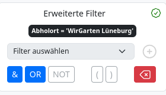

# Benutzer Handbuch

1. [Email Konfiguration](#email-konfiguration)
2. [Segmente](#segmente) \
   2.1. [Dynamische Segmente](#dynamische-segmente) \
   2.2. [Statische Segmente](#statische-segmente) \
   2.3. [Segment Beispiele](#beispiele) \
   2.4. [Filter](#filter) \
   2.4.1. [Filter Beispiele](#beispiele-1)
3. [Trigger (TBD)](#trigger)

## Email Konfiguration

Eine Email Konfiguration besteht aus:

- Layout
- Inhalt
- Betreff
- Segment
- Trigger

Wenn eine Email Konfiguration im Status "veröffentlicht" ist, dann wird sie zu dem festgelegten Zeitpunkt oder Trigger an die gewählten Segmente verschickt.

## Segmente

Ein Segment ist eine vorgefilterte Gruppe von Email Empfängern.

### Dynamische Segmente

Dynamische Segmente beziehen sich auf Tapir Nutzer bzw. Mitglieder. \
Diese Segmente können: \

- addiert und subtrahiert werden
- durch Filter verfeinert werden

Einzuschließende Segmente (Addition) werden grün dargestellt: \

Auszuschließende Segmente (Subtraktion) werden rot dargestellt: \

### Statische Segmente

Statische Segmente sind i.d.R. vom Admin festgelegte Empfängergruppen. Diese sind frei konfigurierbar und die Empfänger müssen keinen Tapir Account haben.
Filter haben keinen Einfluss auf statische Segmente. Diese Segmente werden am Ende addiert und können nicht subtrahiert werden.

Statische Segmente werden blau dargestellt: \

### Beispiele

#### Alle Geno Mitglieder

a) Angenommen es gibt kein fertiges Segment dafür:

1. Segment `Alle Benutzer` wählen und + (Plus) klicken
2. Segment `Nicht Geno-Mitglied` wählen und - (Minus) klicken \

b) Passendes Segment wählen:

1. Segment `Geno-Mitlgied` wählen und + (Plus) klicken \

Beide Wege erzeugen die gleiche Empfängergruppe.

### Filter

Die selektierten dynamischen Segmente können durch Filter verfeinert werden.
Es stehen die logischen Operatoren `NOT`, `AND` und `OR` zur Verfügung, sowie Klammern.\

Für jeden Empfänger treffen alle Filter zu. D.h. wenn ein Empfänger nicht alle Filter erfüllt, wird er aus dem Segment entfernt.
Siehe [Nach mehreren Abholorten Filtern](#nach-mehreren-abholorten-filtern) für ein Beispiel.

Eine Filterung kann niemals mit AND oder OR beginnen oder enden. Die Komponente aktiviert und deaktiviert die auswählbaren Operatoren automatisch.
Wenn der Filter nicht valide ist, wird eine entsprechende Fehlermeldung angezeigt (dieser Filter endet mit OR): \

#### Beispiele

##### Einfache Filterung

- Segment `Mit laufendem Erntevertrag` Filter: `Abholort = 'WirGarten Lüneburg'` \
  --> Alle Empfänger mit laufendem Erntevertrag und Abholort 'WirGarten Lüneburg'

##### Nach mehreren Abholorten Filtern

**Falsch:**

- Filter: `Abholort = 'WirGarten Lüneburg' AND Abholort = 'Edeka Bergmann'` \
  --> Ein Empfänger kann nur einen Abholort haben, d.h. es gibt keinen Empfänger, der beide Abholorte hat und die Empfängerliste ist immer leer.

**Richtig:**

- Filter: `Abholort = 'WirGarten Lüneburg' OR Abholort = 'Edeka Bergmann'` \
  --> Wenn der Empfänger am Abholort 'WirGarten Lüneburg' **oder** 'Edeka Bergmann' abholt, dann wird er in das Segment aufgenommen.

##### Richtige Benutzung von AND

- Segment `Mit laufendem Erntevertrag` Filter: `Abholort = 'WirGarten Lüneburg' AND Vertrag verlängert = 'Ja'` \
  --> Alle Empfänger mit laufendem Erntevertrag die am Abholort 'WirGarten Lüneburg' abholen und den Vertrag bereits verlängert haben.

##### Komplexeres Beispiel mit Klammern

- Segment `Mit laufendem Erntevertrag` Filter: `(Abholort = 'WirGarten Lüneburg' OR Abholort = 'Edeka Bergmann') AND Vertrag verlängert = 'Ja'` \
  --> Alle Empfänger mit laufendem Erntevertrag die am Abholort 'WirGarten Lüneburg' oder 'Edeka Bergmann' abholen und den Vertrag bereits verlängert haben.

##### NOT mit und ohne Klammerung

Diese beiden Filterungen sehen ähnlich aus, haben aber unterschiedliche Ergebnisse:

Ohne Klammerung:

- Filter: `NOT Abholort = 'WirGarten Lüneburg' OR Abholort = 'Edeka Bergmann'` \
  --> Alle Empfänger die nicht am Abholort 'WirGarten Lüneburg' abholen ODER die am Abholort 'Edeka Bergmann' abholen.
  Da die zweite Bedingung immer auch zutrifft wenn die erste zutrifft, hat der zweite Part keine Bedeutung. Es ist äquivalent zu `NOT Abholort = 'WirGarten Lüneburg'`.

Mit Klammerung:

- `NOT (Abholort = 'WirGarten Lüneburg' OR Abholort = 'Edeka Bergmann')` \
  --> Alle Empfänger die weder am Abholort 'WirGarten Lüneburg' noch am Abholort 'Edeka Bergmann' abholen.

## Trigger

TBD
